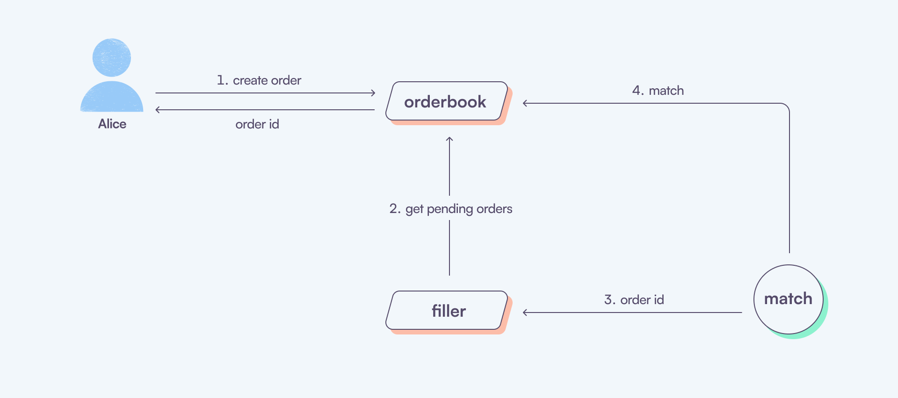
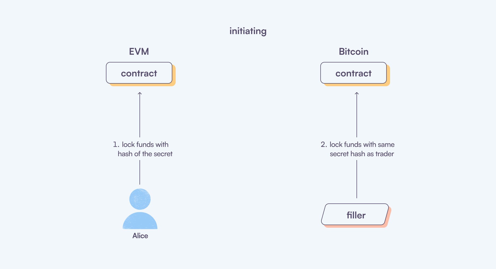
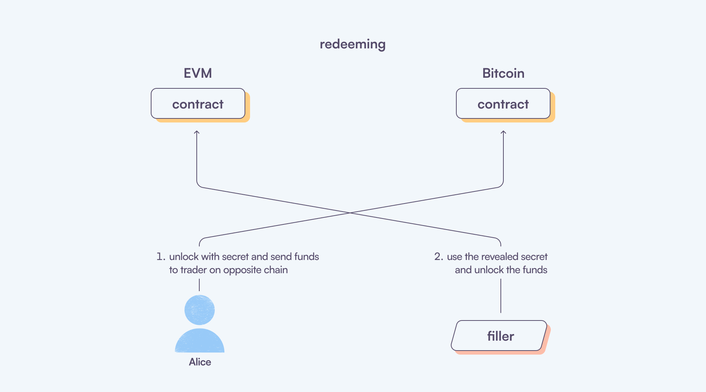
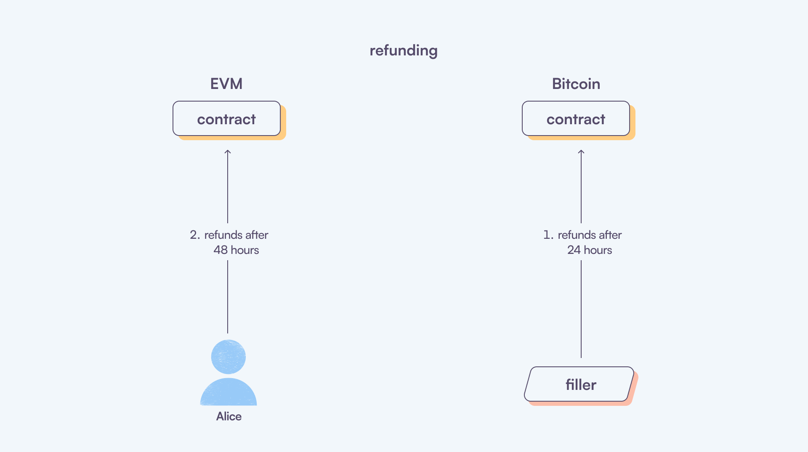

import DocCardList from '@theme/DocCardList';

# Garden SDK
The **Garden SDK** is a set of typescript packages that allow you to bridge Bitcoin to EVM or non-EVM chains. It is an abstraction over the Garden APIs, allowing developers to integrate Garden components into their dApps easily.

Want to know how everything works internally? Check out [Core Concepts](./CoreConcepts.md).

## Features
- **Cross-chain swaps**: Swap assets between Bitcoin and EVM or non EVM chains.
- **OTAs**: Create one-time Bitcoin accounts using your Web3 providers, giving you access to all Bitcoin wallet features.
### Integrating Garden SDK v2

Integrating Garden SDK v2 into your dApp should feel as smooth as planting seeds in fertile soil (pun intended). Let’s get you up and running in no time.  

---

### The big picture: how it works  

Bringing Bitcoin to EVM or non-EVM chains or vice versa is not a simple process. To accomplish this, Garden utilizes an atomic swap contract. If Alice, a trader, wants to swap her Bitcoin for an asset on any chain or Ethereum itself, she needs a way to communicate with Garden that she wants to swap Bitcoin. This is where Garden comes into play; Garden uses an Orderbook engine to create orders that are matched by actors known as Solvers. Alice can now use the Garden to place an order to swap her Bitcoin for WBTC on Ethereum. We'll cover more details on how this swapping works below.

## Orders

An order is a request to swap assets between two chains. It is created by a trader and matched by a Solver. The order is executed using a concept called [Atomic Swaps](https://www.catalog.fi/blog/atomic-swaps).

## Order matching

When you place an order, as previously explained, it gets matched by a Solver. In simple terms, a Solver is the counterparty in the trade. Solvers play a role as liquidity providers within the Garden ecosystem and are incentivized to match and fulfill orders.

## Settlement

:::note
This section assumes you have basic knowledge of how atomic swaps work. If you are new to atomic swaps, we recommend you read [this](https://www.catalog.fi/blog/atomic-swaps) blog post.
:::

Garden uses an **Atomic Swap smart contract to execute the swap on EVM-based chains**. In the case of Bitcoin, it generates a **Hash Time Locked Contract (HTLC)** on demand to execute the swap.

### Initiating

Once the order is matched, the trader must complete their part of the trade by sending the assets to the respective contract. For instance, if Alice exchanges Bitcoin for WBTC on Ethereum, she transfers her Bitcoin to the Bitcoin HTLC script created by Garden. Conversely, when swapping WBTC for Bitcoin, she would send her WBTC to the official atomic swap smart contract. However, it's important to note that the trader generates a secret and uses its hash to lock the funds in the contract. We do not share the secret instead, the funds are secured using the hash of the secret. Only someone with access to the secret can claim the funds.

Meanwhile, the Solver monitors the trader's actions and completes their side of the trade using the same secret hash.

Importantly, the secret is never revealed until the Solver initiates it. It remains secure on the client side. Only the hash of the secret is included in the order request.

### Redeeming

When the trader and the Solver have initiated the order, the trader can now redeem the funds. This is accomplished by revealing the secret to the contract. The contract verifies the secret; if it matches, the funds are released to the trader. The Solver utilizes the revealed secret to redeem their side of the funds.

### Refunding

The contract has a refund mechanism if the trader fails to redeem the funds. The trader has the option to refund the funds back to their wallet. Similarly, if the trader fails to redeem the funds, the Solver refunds back their funds. The refund process operates on a time-based mechanism, allowing funds to be refunded after a specified period. Typically, traders have a refund period of 48 hours, while Solvers have a refund period of 24 hours.

---

#### What’s new in v2?  
We’ve reduced user dependencies and improved the overall experience, making it simpler and more intuitive for both developers and users alike.

## How it works with code?

- **Authentication**: Use `Siwe` to authenticate your Ethereum wallet with the Garden orderbook.  
- **Quote service**: Use `Quote` to fetch price details for swaps.  
  - Supports attested quotes to ensure price validity and trust during execution.  
- **Secret manager**: Generate and manage secrets for order security.  
- **Wallets**:  
  - Ethereum Wallet via `viem`.  
  - Bitcoin Wallet via `@catalogfi/wallets`.  
- **Garden core**: The heart of the SDK for creating and managing orders.  
- **Relay service**: For gasless swaps using the `EvmRelay`.  

> **Note:** If you’re using our React hooks, we’ve abstracted these complexities for you—making integration effortless! 🎉