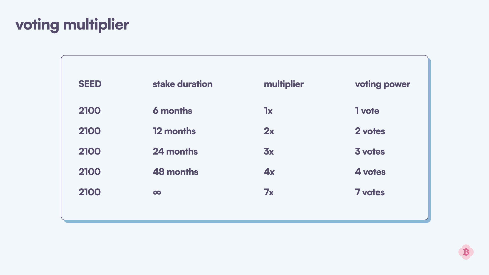

# Governance

At Garden, we have always been vocal about our community-first ethos. The governance framework is created to put these words into action. To participate in governance, one must hold a minimum of 2,100 SEED. (1 vote)

The [multiplier effect](../home/basics/stake/Stake.md#staking-multiplier) discussed in staking applies to governance votes as well.

For example, if you hold 21,000 SEED and it is staked for 24 months, then your total voting power is 30 votes.

**Prerequisites for raising a proposal:**

- 500 votes for creating a governance proposal
- 6,000 votes for approving a proposal

## Proposal Process:

### 1. Sentiment Check

Before raising a proposal at Garden, it is essential to initiate a Sentiment Check in the [#Governance](https://discord.gg/kqMBgeAKAh) channel on our Discord. This preliminary step allows you to gauge community interest and determine whether there is sufficient support to alter the status quo. Engage with community members to discuss your idea, gather feedback, and understand the community's perspective. If your proposal message on Discord receives more than 10 :arrow_up_small: (up votes), then you can move to the next step of the formal proposal process.

Once sentiment check is passed the proposal moves to Garden Improvement Proposal (GIP) stage, where gardeners who have staked SEED will formally vote on the proposal via Snapshot.

### 2. Raise a Proposal

After your proposal receives over 10 :arrow_up_small: (up votes) on Discord, indicating successful passage through the Sentiment Check, you can proceed to the formal proposal stage. Proposals should be submitted for community voting on [Snapshot](https://snapshot.org/#/gardenfinance.eth).

In your proposal, clearly state the problem you aim to address and describe the proposed solution in detail. Outline actionable steps required to implement this solution, providing links to any relevant code repositories or resources. Additionally, discuss the expected outcomes, detailing both the potential benefits and any risks. This comprehensive approach ensures the community can make well-informed decisions on each proposal.

Raising a proposal without doing a Sentiment Check is possible if you hold a minimum of 500 votes, but it would mostly result in a failed proposal as gauging community interest is an important element of getting your proposal enough votes to pass.

### 3. Voting Period

The next step in the process is the "Voting Period," which spans 7 days. During this critical time, it is vital to actively engage with the community on Discord to generate excitement and support for your proposal. Encourage discussions, answer questions, and highlight the benefits of your proposal to motivate community members to participate in the voting process. This period is your opportunity to rally the community's backing and secure the votes needed to move your proposal forward.

### 4. Implementation

The Implementation phase commences once a proposal achieves a quorum of at least 6,000 votes, signifying its official passage. At this stage, the Garden core team will initiate contact with you to collaboratively work on the proposal's execution. This close cooperation ensures your proposal is implemented effectively, aligning with Garden's strategic goals and community interests.

A Governance Forum is a work-in-progress that will help us record all proposals, discussions, and implementation history. Until then, Snapshot can be used to raise proposals and the Discord community to discuss the proposals.
