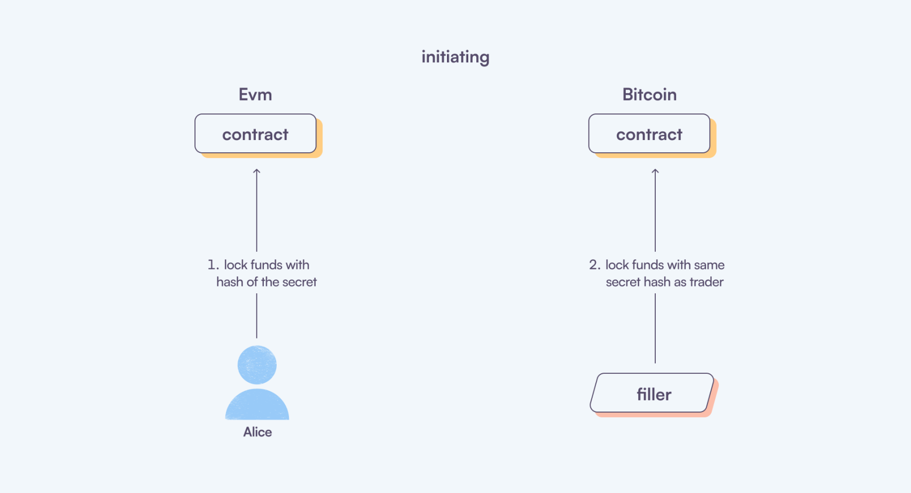
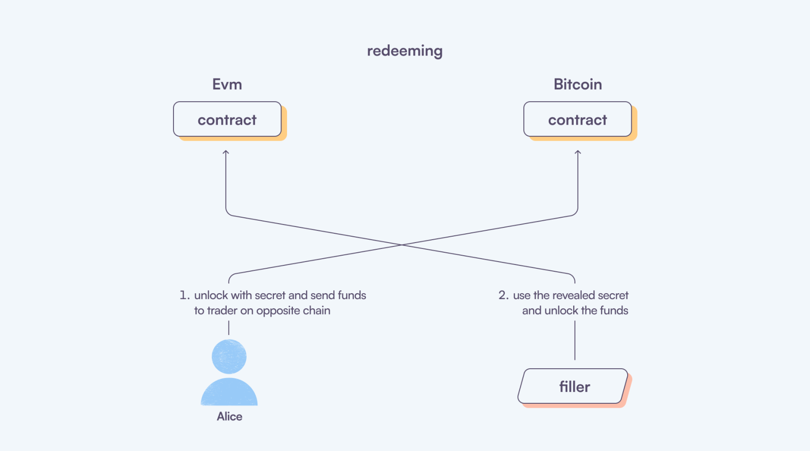
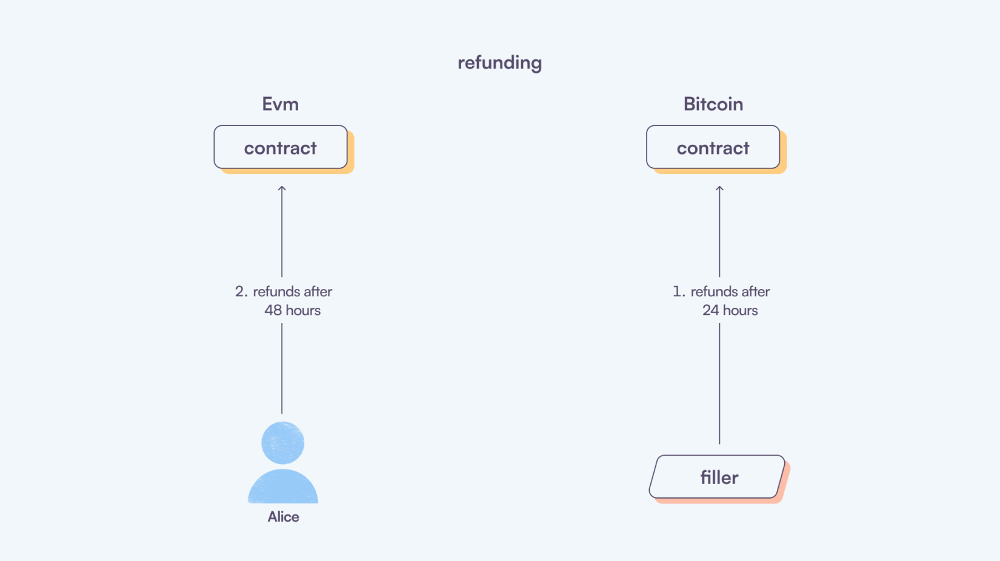

# Core Concepts

Bringing Bitcoin to EVM-based chains or vice versa is not a simple process. To accomplish this, Garden utilizes an atomic swap contract. If Alice, a trader, wants to swap her Bitcoin for an asset on an EVM-based chain or Ethereum itself, she needs a way to communicate with Garden that she wants to swap Bitcoin. This is where Garden comes into play; Garden uses an Orderbook engine to create orders that are matched by actors known as Fillers. Alice can now use the Garden to place an order to swap her Bitcoin for WBTC on Ethereum. We'll cover more details on how this swapping works below.

## Orders

An order is a request to swap assets between two chains. It is created by a trader and matched by a Filler. The order is executed using a concept called [Atomic Swaps](https://www.catalog.fi/blog/atomic-swaps).

## Order Matching

When you place an order, as previously explained, it gets matched by a Filler. In simple terms, a Filler is the counterparty in the trade. Fillers play a role as liquidity providers within the Garden ecosystem and are incentivized to match and fulfill orders.

## Settlement

:::note
This section assumes you have basic knowledge of how atomic swaps work. If you are new to atomic swaps, we recommend you read [this](https://www.catalog.fi/blog/atomic-swaps) blog post.
:::

Garden uses an **Atomic Swap smart contract to execute the swap on EVM-based chains**. In the case of Bitcoin, it generates a **Hash Time Locked Contract (HTLC)** on demand to execute the swap.

### Initiating

Once the order is matched, the trader must complete their part of the trade by sending the assets to the respective contract. For instance, if Alice exchanges Bitcoin for WBTC on Ethereum, she transfers her Bitcoin to the Bitcoin HTLC script created by Garden. Conversely, when swapping WBTC for Bitcoin, she would send her WBTC to the official atomic swap smart contract. However, it's important to note that the trader generates a secret and uses its hash to lock the funds in the contract. We do not share the secret instead, the funds are secured using the hash of the secret. Only someone with access to the secret can claim the funds.

Meanwhile, the Filler monitors the trader's actions and completes their side of the trade using the same secret hash.

Importantly, the secret is never revealed until the Filler initiates it. It remains secure on the client side. Only the hash of the secret is included in the order request.

### Redeeming

When the trader and the Filler have initiated the order, the trader can now redeem the funds. This is accomplished by revealing the secret to the contract. The contract verifies the secret; if it matches, the funds are released to the trader. The Filler utilizes the revealed secret to redeem their side of the funds.

### Refunding

The contract has a refund mechanism if the trader fails to redeem the funds. The trader has the option to refund the funds back to their wallet. Similarly, if the trader fails to redeem the funds, the Filler refunds back their funds. The refund process operates on a time-based mechanism, allowing funds to be refunded after a specified period. Typically, traders have a refund period of 48 hours, while Fillers have a refund period of 24 hours.

